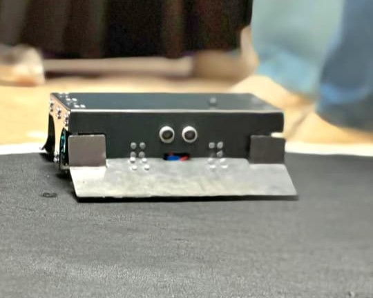
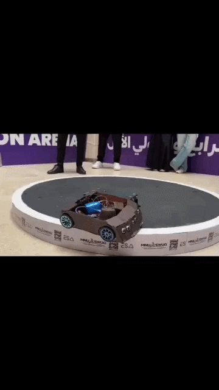
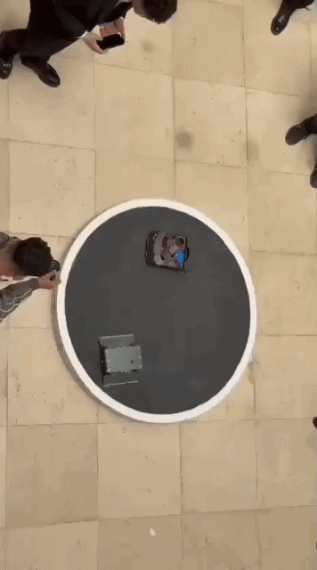

# Autonomous Sumo Robot - Project NOVA 🤖

  

A fully autonomous combat robot designed for Sumo competitions. Built with a focus on high-torque movement, low-latency sensor response, and a robust mechanical chassis.

---

## 🛠 Project Components
* **Mechanical:** Custom chassis designed in **SolidWorks**. Optimized for low center of gravity.
* **Electronics:** Arduino-based control system with Dual-Bridge motor drivers.
* **Sensors:** 4-point IR Line Detection + Dual-end Ultrasonic sensing (Front/Back).
* **Firmware:** Written in C++ with a prioritized state-machine logic.

---

## 🧠 Logic Strategy
The robot's behavior is governed by a priority-based system to ensure ring survival:
1.  **Line Avoidance (Critical):** Immediate reverse and pivot maneuver when 4x IR sensors detect the Dojo border.
2.  **Target Lock (Combat):** Active scanning for opponents within **45cm**. Once detected, the robot engages at `ATTACK_SPEED` (PWM 255).
3.  **Search Pattern:** A timed "Spin & Dash" algorithm to maximize ring coverage while scanning for targets.

---

### 🎥 System Tests

  
  

  <i>Left: Enemy detection and attack | Right: Border avoidance and recovery</i>

---

## 🔌 Wiring & Pin Mapping
| Module | Components | Pins |
| :--- | :--- | :--- |
| **Drivetrain** | 4x Motors (Right/Left) | **R:** 2,3,4,5,10(PWM) | **L:** 6,7,8,9,11(PWM) |
| **Object Sensing** | Front & Back Ultrasonic | **F:** 26(T), 27(E) | **B:** 28(T), 29(E) |
| **Line Detection** | 4x IR Sensors | 22, 23, 24, 25 |
### 🔌 Full Wiring Diagram

  

---

## 📂 Repository Structure
* `Hardware/`: SolidWorks assembly, parts, and **STEP** files.
* `Firmware/`: Optimized C++ source code (`.ino`).
* `Schematics/`: Pinout details and wiring documentation.

---

## 👥 NOVA Team
* Mostafa Mohamed
* Mahmood Samy
* Moamen Mohamed
* Mariam Mohamed
* Menna Ramadan
* Karim Habib
* Ahmed Mohamed
* Youssef Omar
* Malak Mourad

---

  <b>Mansoura National University | AI Engineering</b>

